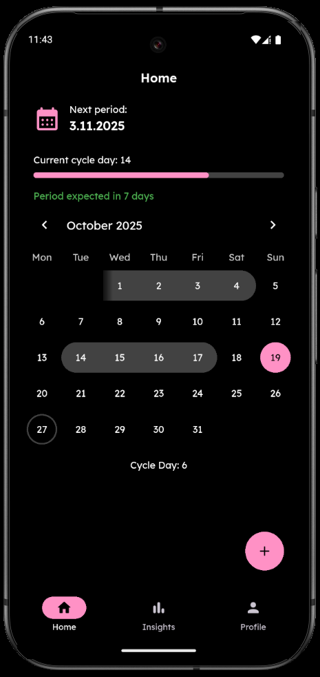
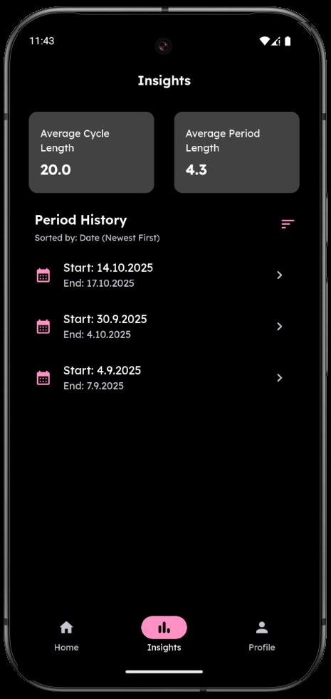
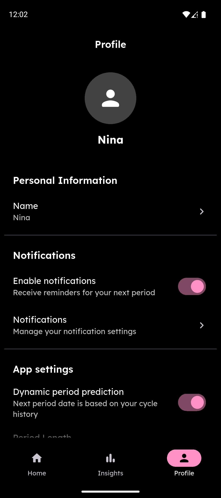
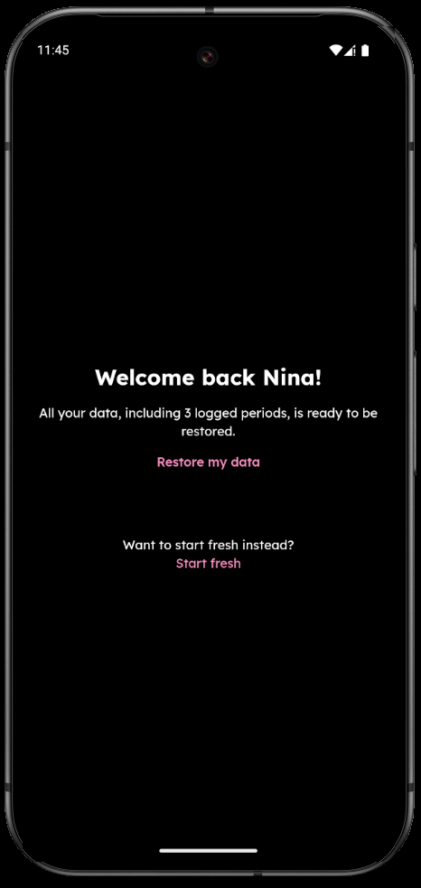

  
  <h1 align="center">Period Tracker</h1>

  Period tracking mobile app I built for my girlfriend. She needed a simple app to track her period cycle without all the annoying ads and premium subscription offers. Requires no internet access, all data is stored on device.

## Features
- Effortless cycle logging with a clean, easy-to-use design
- Insights - average cycle and average period length
- Dynamic period prediction - smartly adjusts based on past cycles
- Static mode - set a fixed period & cycle duration for consistent tracking
- Customizable reminders - get notified n days before your period starts
- Offline data transfer between devices (for restoring data on a new device)
- Easter eggs :)

## Download

  
   
   
  
   
  

    <i>Available on Google Play Store and as a direct APK download. Not available on App Store because because fuck Apple and their $99/year membership</i>
  

## Gallery

## Legal
All data is stored locally on your device and is never transmitted. Complete privacy policy is available [here](https://www.freeprivacypolicy.com/live/46902e6f-ed7c-4546-9990-e86785c11694).

Distributed under the [MIT License](/LICENSE.txt).

## Development
Pull requests are always welcome! For major changes, please open an issue first to discuss the changes.

Period Tracker is built entirely with Flutter. To get started:
- Install Flutter 3 or higher and Android Studio (needed for Android emulator)
- Fork & clone the repository
- Install dependencies: `flutter pub get`
- Create a branch and name it like "*feature/issueId/short-desc*" for features or "*bugfix/issueId/short-desc*" for bugfixes. 
Eg: *feature/23/backup*
- Develop, test, commit, push (use descriptive commit messages)
- Open a pull request and name it like "*fix: #issueId - issueTitle*".  
Eg: *fix: #31 - Backup and restore data* 
Please provide a clear PR description

### Debug build
To run the app in debug mode use: 
`flutter run --debug`

### Release build
To run app in release mode you will need `android/key.properties` file. Structure of this file can be found in `example-key.properties` file.

To run the app in release mode run: 
`flutter run --release`

To prepare app for publishing run: 
`flutter build appbundle --release`

Make sure to update the version and build number before every release.

### Useful tips
- If you're encountering strange bugs, run `flutter clean` followed by `flutter pub get`
- Running emulator via CLI:
`emulator -avd <AVD_NAME> -no-snapshot-save -no-boot-anim -gpu host -accel on`
